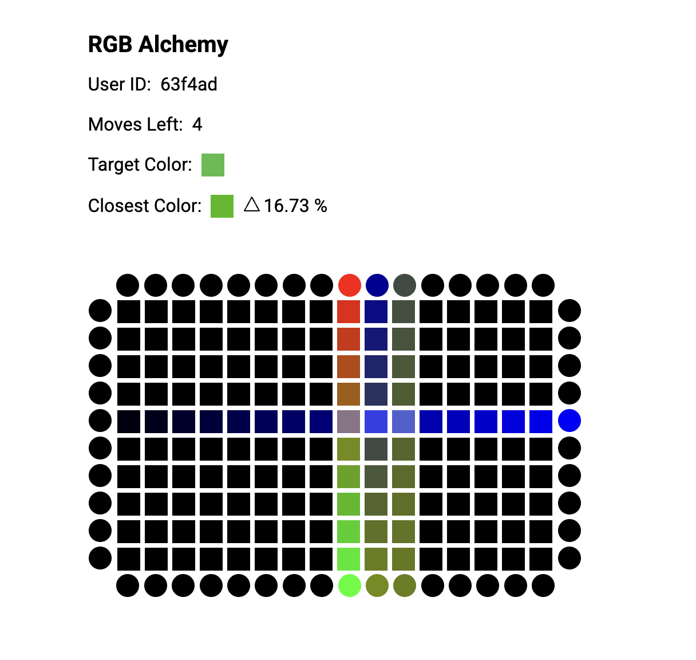

# Submission - RGB Alchemy

[Demo Video](https://www.loom.com/share/33e47093b46c45dc82014da7be8ea405?sid=c7e64616-652e-4c53-a943-863d2e15526b)


Color-matching puzzle game built with React + TypeScript.


## Summary

In **RGB Alchemy**, Create a color that closely matches the target color using only three initial RGB sources and a limited number of moves.

1. **Click** up to 3 directional sources (top, bottom, left, right) to emit Red, Green, and Blue light. _(the circle are called sources)_
2. Each source emits a **fading gradient** of color across tiles.
3. After the 3 moves, **drag and drop** any tile(square box) onto a source to update it with that tile's color.
4. Tiles affected by multiple sources will **blend and normalize** the contributions.
5. Win if your closest tile color is less than **10%** of the target.

## Tech Stack

- **React + TypeScript**
- **Vite** 
- **Pure DOM drag-and-drop API**

## To Run Locally:

```bash
git clone https://github.com/blossom-babs/LiveBarn-Frontend.git
cd rgb-alchemy
npm install
npm run dev
```

Runs on: `http://localhost:5173`

Kindly ensure server is set up before playing, mock server from instructions [here](https://hackmd.io/@gd_dVYF0STqPqMLWkxnd6A/Byrxur5At#API-docs).

[Progressive Todo](todo.md)
